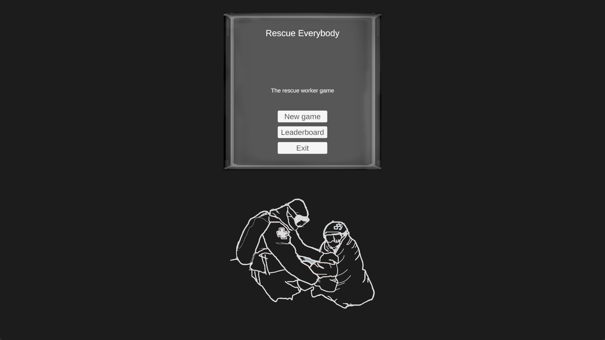
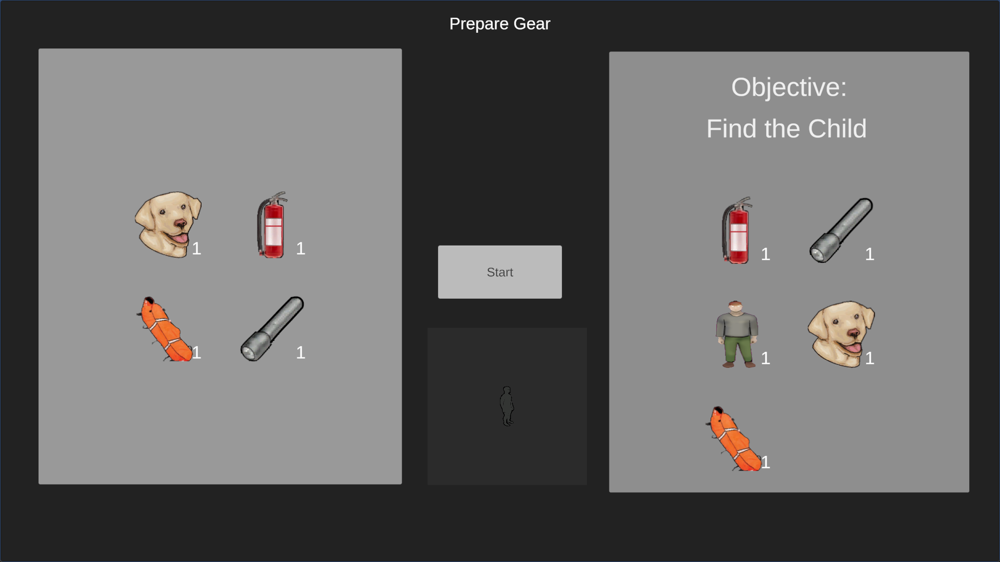
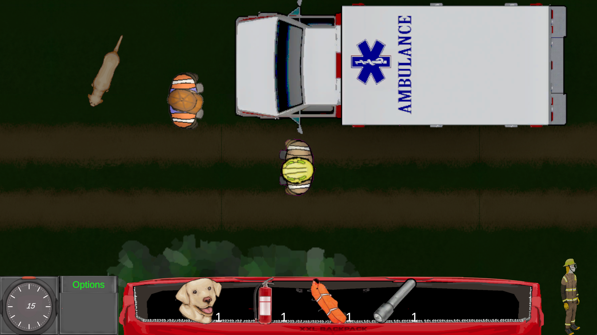
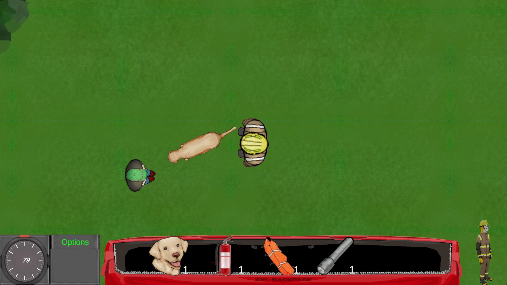

# 🚒 Emergency Rescue Game

This game was made together with my classmates in 2023. It’s a small Unity project where you play as a firefighter, pick your gear, and try to rescue missing people as fast as possible.

## 🎮 Features
- Top-down 2D emergency game
- Gear selection system (flashlight, extinguisher, dog, planket, etc.)
- Time-based scoring system
- NPCs (firefighters, civilians, animals) to interact with
- Objective-based gameplay (e.g., **Find the Child**)
- Options and info menu with controls

## 🖼️ Screenshots

### Menu

### Gear Preparation

### Gameplay

## 🎥 Demo Video
*Watch it here:*
https://vimeo.com/1114466293

## 🛠️ Technologies Used
- **Engine:** Unity 
- **Language:** C#  
- **Version Control:** Git & GitHub  

## 🎯 How to Play
- Movement: `WASD` or `Arrow Keys` 
- Sprint: `Left Shift` or `Right Shift`  
- Use items: `1/2/3`
- Objective: Complete rescue tasks as fast as possible.  

## 📜 License

This project is provided for **personal and educational use only**.  
Commercial use, redistribution, or selling of this project is **not allowed** without permission from the authors.
